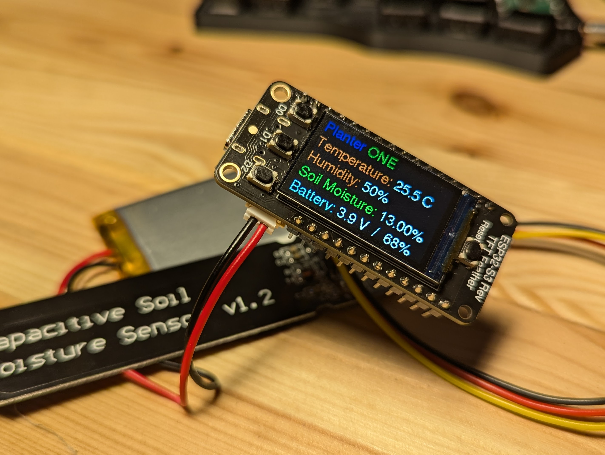

# Planter ONE

A Plant monitoring device based of a [Adafruit ESP32-S3 Reverse TFT Feather](https://www.adafruit.com/product/5691). Starting with it's example code.

Objective is to have one of this devices managing possibly up to 4 plants.

This includes:

- Soil Moisture Monitoring
- Ambient temperature and humidity monitoring
- Triggering micro water pumps
- Some MQTT or other WiFi connectivity for status tracking
- Quick status visualization on the TFT display

Stay tunned for updates.

